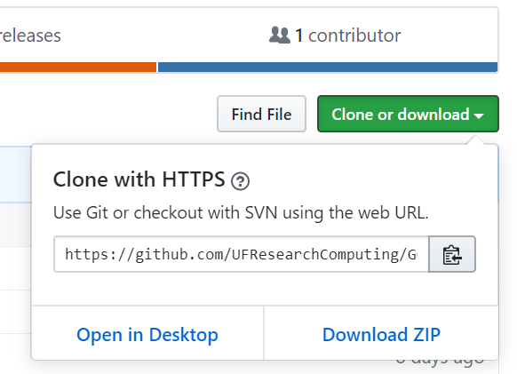
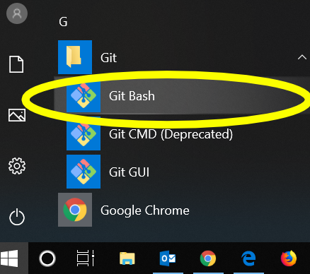
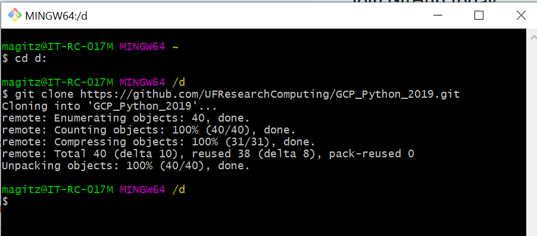
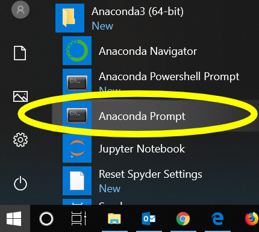

# GCP_Python_2019

This repository is for the [Gator Computing Program 2019](https://www.rc.ufl.edu/about/gcp/) Python lessons at the University of Florida.

GCP is run by Research Computing.

Lessons 1 & 2 were written by Matt Gitzendanner.

## Intro

The easiest way to run the first two lessons is to use [Anaconda](https://www.anaconda.com/) on your computer. In addition to Anaconda, install [pygame](https://www.pygame.org/). The easiest way to do that is to use your terminal (MacOS) or Anaconda Prompt (Windows) to run `pip install pygame`.

### Cloning this site onto your flash drive

 Steps in cloning a GitHub repository to your computer| Screenshot guidance
-------|-------
Clone this site onto your flash drive. Click the **Clone or download** button and then the copy button to copy the link into your clipboard. | 
Open Git bash from the ***Windows > Git > Git bash*** menu | 
Your USB flash drive should be drive D:. If so, in the Git Bash window, type: `cd d:` and hit Enter  Then type `git clone `, **followed by a space**, and right click to paste the link (you CANNOT use control-V here to paste).   Then hit Enter. | 

## Learning Python Through `pygame`

### [Lesson 1: Bouncy Ball](Lesson_1_BouncyBall/Bouncy_Intro.ipynb) 

This is the first lesson and teaches many basic Python programming concepts through a simple bouncing ball "game". 

This lesson uses a Jupyter notebook. Open the Anaconda Prompt from the ***Windows > Anaconda > Anaconda Prompt*** menu.

Once the Anaconda opens, we need to navigate to your cloned repository on the USB drive.

Type: `d:`

Type: `cd GCP_Python_2019/Lesson_1_BouncyBall`

Type: `jupyter lab`

Once your web browser opens, click on the Bouncy_Intro.ipynb. 

### [Lesson 2: Chimp Game](Lesson_2_Chimp/Readme.md) 
The second lesson is a series of markdown pages that lead you through the inner workings of a simple game.

[Start here](Lesson_2_Chimp/Readme.md) 

You will want to have one window open with these pages and one window open with [the code](Lesson_2_Chimp/chimp.py) to follow along.
